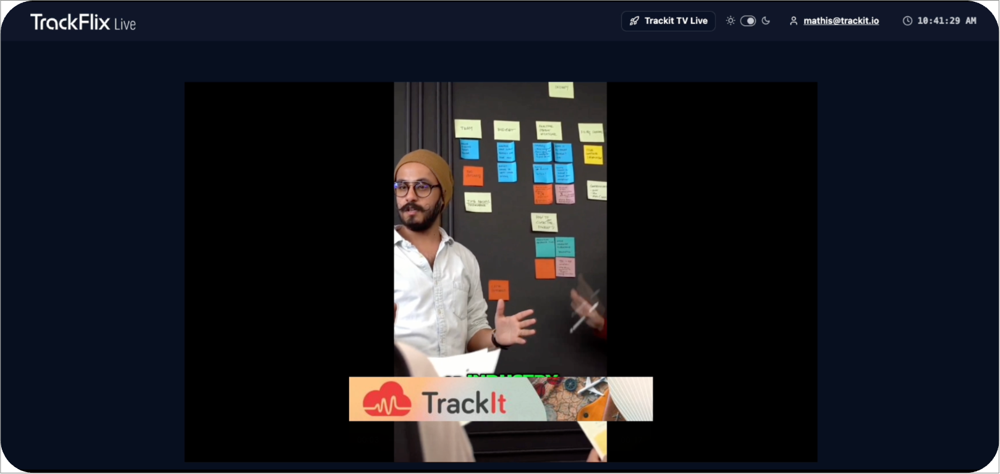
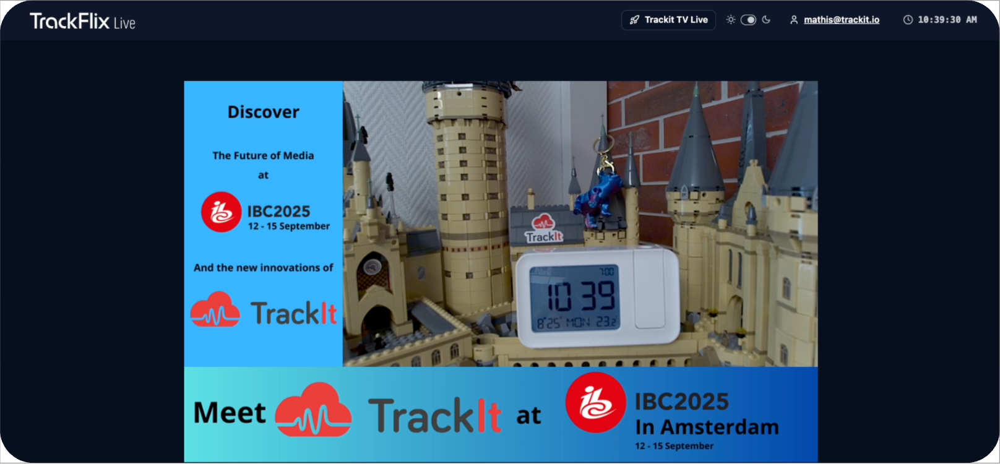

# Technical Guide: Non-Linear Ad Insertion - TrackFlix Live TV

## 1. Introduction and context

### What is a non-linear ad?

In online video, there are two main families of advertisements:

- **Linear**: they **replace** the video content (pre-roll, mid-roll, post-roll). The viewer must watch the ad before seeing their content.
- **Non-linear**: they are displayed **on top of** the video content without interrupting it. The viewer continues watching their video while the ad is visible.

```
  LINEAR AD                             NON-LINEAR AD
  ┌──────────────────────┐              ┌──────────────────────┐
  │                      │              │                      │
  │    ██████████████    │              │   Video playing...   │
  │    █  AD VIDEO  █    │              │                      │
  │    ██████████████    │              │                      │
  │                      │              │  ┌────────────────┐  │
  │  "Your video in      │              │  │  Overlay ad    │  │
  │   15 seconds..."     │              │  └────────────────┘  │
  └──────────────────────┘              └──────────────────────┘
  Video is REPLACED                     Video KEEPS playing
```

### Why this technical choice?

Non-linear ads offer several advantages for a live TV service:

1. **No interruption**: the viewer experience is not disrupted, which is crucial for live content
2. **Soft monetization**: overlays are less intrusive than a pre-roll
3. **Flexibility**: different formats can be displayed (banners, L-shaped) without touching the video stream

### Which types of non-linear ads do we support?

Our system supports two formats:

**Simple overlay**: a static image (banner) positioned at the bottom of the video player. Typical format: 480x70 pixels. Display duration is configurable (8-15 seconds by default). The TrackIt banner appears over the video without interrupting it:



**L-Shaped**: two images forming an "L" around the video. One horizontal image (top or bottom) and one vertical image (left or right). The video is dynamically resized to make room for the ads. Supports 4 positions: `top-right`, `top-left`, `bottom-right`, `bottom-left`. Here, the video is "pushed" to the top-right to make room for the TrackIt banners:



---

## 2. Overall video streaming architecture

### Overview

The system relies on a chain of AWS services that transform a raw video stream into a broadcastable stream with integrated advertisements:


The key point: **MediaTailor does not visually insert the ad into the video**. It inserts **metadata** (markers) into the HLS manifest. It is then the **client** (our React code) that reads this metadata and displays ad components on top of the video.

---

## 3. AWS Pipeline: from source to browser

The video stream passes through 4 AWS services before reaching the viewer. Each has a distinct role:

| Service | In one sentence |
|---------|----------------|
| **AWS MediaLive** | Receives the raw stream (camera or MP4 file) and transcodes it into **9 simultaneous qualities** (from 234p to 1080p) to enable adaptive bitrate |
| **AWS MediaPackage** | Takes the MediaLive output and packages it into **HLS** (.m3u8) and **DASH** (.mpd) formats readable by browsers |
| **Amazon CloudFront** | Distributes the stream via a **global CDN** so each viewer is served by the nearest server |
| **AWS MediaTailor** | Acts as a proxy and **enriches the HLS manifest** with ad metadata (VAST) |

### Transmission creation order

When a new transmission is launched, the services are created in this order (each step depends on the previous one):

1. **MediaPackage** first (packaging) — because MediaLive needs to know where to send its output
2. **MediaLive** next (transcoding) — connected to MediaPackage
3. **CloudFront** — an origin is dynamically added pointing to the MediaPackage endpoints
4. **Start** the MediaLive channel — the stream begins broadcasting

The final broadcast URL looks like:
```
https://d2cg1811dvxahw.cloudfront.net/v1/master/.../index.m3u8
```

> **Source files**:
> - `apps/api/src/infrastructure/MediaLiveChannelsManager.ts`
> - `apps/api/src/infrastructure/MediaPackageChannelsManager.ts`
> - `apps/api/src/infrastructure/CloudFrontDistributionsManager.ts`

---

## 4. AWS MediaTailor: integration and session

In our case, we use MediaTailor specifically for **non-linear** ads: it does not replace video segments, but **enriches the HLS manifest with metadata** that the client then reads to display overlays.

### 4.1. The MediaTailor session

Each viewer creates a unique **session** by making a POST request to a URL built from the MediaTailor configuration. This session provides two essential URLs: the enriched manifest (to be read by the player) and the tracking URL (to be polled for ad metadata).

**The session URL** is built as follows:

```
https://{endpoint}/v1/session/{accountId}/{configName}/index.m3u8
         │                      │            │
         │                      │            └── MediaTailor configuration
         │                      │                name (contains the
         │                      │                insertion rules)
         │                      │
         │                      └── AWS account ID
         │
         └── MediaTailor endpoint (region-specific)
```

When a **POST** is made to this URL, MediaTailor responds with:
- `manifestUrl`: the URL of the enriched HLS manifest (the one the video player must read)
- `trackingUrl`: the URL to poll regularly to retrieve ad metadata to display

This `trackingUrl` is at the heart of the client-side mechanism.

### 4.2. The tracking URL: core of the non-linear system

The `trackingUrl` is the endpoint that the client polls periodically (every 30 seconds in our case) to find out if ads need to be displayed. The response contains an array of `avails` (ad slots) in JSON format:

```json
{
  "avails": [
    {
      "availId": "abc-123",
      "nonLinearAdsList": [
        {
          "nonLinearAdList": [
            {
              "adId": "trackit-overlay-001",
              "adTitle": "Trackit Social Listening",
              "creativeId": "overlay-banner",
              "staticResource": "https://...480x70.jpg",
              "clickThrough": "https://trackit.io",
              "width": "480",
              "height": "70",
              "durationInSeconds": 12
            }
          ]
        }
      ]
    }
  ]
}
```

The `nonLinearAdsList` field specifically contains non-linear ads (overlays). Each `availId` identifies a unique ad slot, which prevents displaying the same ad multiple times.

---

## 5. The VAST standard: how to describe an ad

### 5.1. What is VAST?

VAST (**Video Ad Serving Template**) is an IAB (Interactive Advertising Bureau) standard that defines how to describe a video ad in XML. It is the universal "language" between ad servers and video players.

MediaTailor uses VAST to communicate with the **Ad Decision Server** (ADS). When MediaTailor needs to insert an ad, it makes an HTTP request to the ADS which responds with a VAST document describing the ad to display.

### 5.2. VAST structure for a non-linear ad

Here is the minimal structure for a simple overlay ad:

```xml
<VAST version="3.0">
  <Ad>
    <InLine>
      <AdSystem>2.0</AdSystem>                      <!-- Ad system -->
      <AdTitle>non-linear-ad-1</AdTitle>             <!-- Title for debugging -->
      <Creatives>
        <Creative>
          <NonLinearAds>                             <!-- = non-linear ad -->
            <NonLinear width="480" height="70"       <!-- Dimensions in pixels -->
                       minSuggestedDuration="00:00:10"> <!-- Display duration -->
              <StaticResource creativeType="image/png">
                <!-- Image URL to display -->
                https://bucket-s3.amazonaws.com/480x70.png
              </StaticResource>
              <NonLinearClickThrough>
                <!-- URL opened when the viewer clicks -->
                https://trackit.io
              </NonLinearClickThrough>
            </NonLinear>
          </NonLinearAds>
        </Creative>
      </Creatives>
    </InLine>
  </Ad>
</VAST>
```

Key elements to remember:

| VAST Element | What it contains | Maps to in our code |
|---|---|---|
| `<NonLinear>` | Defines dimensions and duration | `width`, `height`, `duration` in `OverlayAdMetadata` |
| `<StaticResource>` | Ad image URL | `staticResource` |
| `<NonLinearClickThrough>` | Click destination URL | `clickThrough` |
| `<Creative id="...">` | Creative identifier | `creativeId` (used to detect type: "overlay" or "l-shape") |

### 5.3. VAST for an L-Shaped ad

For an L-Shaped ad, the VAST contains **two** `<NonLinear>` elements within the same `<NonLinearAds>`: one for the horizontal image (top) and one for the vertical image (side).

```xml
<Creative id="l-shape-trackit">    <!-- The creativeId contains "l-shape" -->
  <NonLinearAds>
    <!-- Horizontal image (top) -->
    <NonLinear id="trackit-l-shape-top" width="400" height="90">
      <StaticResource creativeType="image/png">
        https://bucket-s3.amazonaws.com/lshape-top-400x90.png
      </StaticResource>
      <NonLinearClickThrough>https://trackit.io</NonLinearClickThrough>
    </NonLinear>

    <!-- Vertical image (side) -->
    <NonLinear id="trackit-l-shape-side" width="90" height="300">
      <StaticResource creativeType="image/png">
        https://bucket-s3.amazonaws.com/lshape-side-90x300.png
      </StaticResource>
      <NonLinearClickThrough>https://trackit.io</NonLinearClickThrough>
    </NonLinear>
  </NonLinearAds>
</Creative>
```

Our code detects an L-Shaped ad when:
1. The `creativeId` contains `"l-shape"` **AND**
2. There are multiple non-linear elements within the same `availId`
3. The "top" and "side" are identified via the `creativeId` (contains "top" or "side")

### 5.4. Where are the ad images hosted?

Assets (images, videos) are stored in an S3 bucket:
- **Bucket**: `trackit-tv-mathis` (region `us-west-2`)
- **Assets**: `480x70.jpg` (overlay), `1000x150.png` (L-shape top), `250x450.png` (L-shape side), etc.

---

## 6. The video player: VideoPlayerAds

### 6.1. Why a wrapper on top of the video player?

The `VideoPlayerAds` component is a wrapper around a standard HLS.js player. This wrapper exists for three reasons:

1. **Integrate MediaTailor**: the native player does not know how to communicate with MediaTailor. Our component handles session initialization, metadata polling, and display decisions.

2. **Manage overlay display**: when MediaTailor signals an ad, the player needs to know which React component to display (OverlayAd or LShapedAd), position it correctly, and hide it after the expected duration.

3. **Track interactions**: every viewer action (play, pause, click on an ad, ad completion) must be reported to MediaTailor for reporting.

```
  Standard HLS.js player             Our VideoPlayerAds
  ┌──────────────────────┐         ┌──────────────────────────────┐
  │                      │         │                              │
  │  - Plays .m3u8 stream│         │  - Plays .m3u8 stream        │
  │  - Manages buffering │         │  - Manages buffering         │
  │  - Adaptive bitrate  │         │  - Adaptive bitrate          │
  │                      │         │  + MediaTailor session       │
  │                      │         │  + Metadata polling          │
  │                      │         │  + OverlayAd display         │
  │                      │         │  + LShapedAd display         │
  │                      │         │  + Event tracking            │
  │                      │         │  + Quality selection         │
  │                      │         │  + Ad deduplication mgmt     │
  └──────────────────────┘         └──────────────────────────────┘
```

### 6.2. The 3 component props

The component is deliberately minimalist in terms of API:

```typescript
<VideoPlayerAds
  src={videoUrl}                           // HLS stream URL
  enableMediaTailorTracking={true}         // Enables the ad system
  mediaTailorSessionInitUrl={sessionUrl}   // URL to initialize the session
/>
```

- **`src`**: the HLS video stream URL (from CloudFront). If MediaTailor is active, this URL will automatically be replaced by the MediaTailor session's `manifestUrl`.
- **`enableMediaTailorTracking`**: boolean on/off. If `false`, the player works as a regular video player with no ads.
- **`mediaTailorSessionInitUrl`**: the URL built from the MediaTailor configuration (endpoint + accountId + configName). This is the URL to which the initialization POST will be sent.

### 6.3. Component lifecycle

Here is what happens when the component is mounted:

```
  Component mount
         │
         v
  1. HLS.js initialization
     - Loads the video stream
     - Detects available qualities
     - Starts playback
         │
         v
  2. MediaTailor initialization (if enabled)
     - POST to sessionInitUrl
     - Receives manifestUrl + trackingUrl
     - Replaces video source with manifestUrl
         │
         v
  3. Polling starts (every 30s)
     ┌─────────────────────────────┐
     │ GET trackingUrl             │<─────────────┐
     │      │                      │              │
     │      v                      │              │
     │ Non-linear ads found?       │              │
     │      │                      │              │
     │    ┌─┴─┐                    │        30 seconds
     │   YES  NO ── (wait) ───────>│──────────────┘
     │    │                        │
     │    v                        │
     │ Already displayed (availId)?│
     │    │                        │
     │  ┌─┴─┐                      │
     │ YES  NO                     │
     │  │    │                     │
     │  │    v                     │
     │  │  creativeId contains     │
     │  │  "l-shape"?              │
     │  │    │                     │
     │  │  ┌─┴────────────┐        │
     │  │ YES            NO        │
     │  │  │              │        │
     │  │  v              v        │
     │  │ LShapedAd   OverlayAd    │
     │  │  │              │        │
     │  │  v              v        │
     │  │ Auto-hide after N sec    │
     │  │                          │
     │  └── (ignore) ─────────────>│──────────────┘
     └─────────────────────────────┘
```

### 6.4. Video source management

A subtle but important point: when MediaTailor is active, we don't play the original video stream but the **MediaTailor manifest**:

```typescript
// The video source is automatically replaced
const videoSrc = mediaTailorSession?.manifestUrl || src;
```

This means that if the MediaTailor session is active, the player reads the enriched manifest (which contains the ad metadata). Otherwise, it uses the original stream.

### 6.5. HLS.js configuration

HLS.js is the library that enables HLS stream playback in browsers (except Safari which supports it natively). Our configuration is optimized for live:

```typescript
const hls = new Hls({
  lowLatencyMode: true,        // Reduces latency for live
  liveSyncDurationCount: 5,    // Number of segments for synchronization
  liveMaxLatencyDurationCount: 10, // Max acceptable latency
  maxBufferLength: 30,         // Max buffer in seconds
  liveDurationInfinity: true,  // No end of stream (it's live)
});
```

> **Source file**: `libs/webui/ui/src/video-player/video-player-ads.tsx`

---

## 7. Client-side MediaTailor service

### 7.1. Service architecture

The client-side MediaTailor service is structured in three layers:

```
  ┌─────────────────────────────────────────┐
  │          React Component                │
  │      (VideoPlayerAds)                   │
  │                                         │
  │  Uses the hook to access                │
  │  data and actions                       │
  └──────────────┬──────────────────────────┘
                 │ uses
                 v
  ┌─────────────────────────────────────────┐
  │       React Hook                        │
  │   (useMediaTailorService)               │
  │                                         │
  │  Synchronizes service state             │
  │  with React state                       │
  │  Provides memoized methods              │
  └──────────────┬──────────────────────────┘
                 │ wraps
                 v
  ┌─────────────────────────────────────────┐
  │       Singleton Service                 │
  │   (MediaTailorService)                  │
  │                                         │
  │  Manages session, polling,              │
  │  ad extraction, tracking                │
  │  Singleton = single instance            │
  └─────────────────────────────────────────┘
```

**Why a singleton?** Because we want a single MediaTailor session per page, even if the component re-renders. The singleton guarantees we don't create multiple sessions or duplicate polling.

**Why a hook on top?** Because the singleton is not "reactive". The hook uses the service's event system to synchronize React state (`useState`) with the service's internal state.

### 7.2. Session initialization

The initialization creates a unique session for this viewer:

```
  Client                          MediaTailor API
    │                                   │
    │  POST /v1/session/{account}/{config}/index.m3u8
    │  Body: { adsParams, sessionParameters }
    │ ─────────────────────────────────>│
    │                                   │
    │ Response: {                       │
    │   manifestUrl: "/v1/manifest/...",│
    │   trackingUrl: "/v1/tracking/..." │
    │ }                                 │
    │ <─────────────────────────────────│
    │                                   │
    │  Returned URLs are relative,      │
    │  the service completes them       │
    │  with the baseUrl                 │
    │                                   │
```

The service then processes the returned URLs: since MediaTailor may return relative URLs (starting with `/`), the service automatically completes them with the endpoint domain.

### 7.3. Polling and ad extraction

Polling is the central mechanism. Every 30 seconds, the service queries the `trackingUrl` and extracts non-linear ads:

```
  GET trackingUrl
       │
       v
  JSON response with "avails"
       │
       v
  For each avail:
       │
       ├── Does the avail have a "nonLinearAdsList"?
       │       │
       │      NO ── (ignore, it's a linear ad)
       │       │
       │      YES
       │       │
       │       v
       │   Is the availId already in displayedAvailIds?
       │       │
       │      YES ── (ignore, already displayed)
       │       │
       │      NO
       │       │
       │       v
       │   Extract metadata:
       │   adId, creativeId, staticResource,
       │   clickThrough, dimensions, duration
       │       │
       │       v
       │   Add to overlayAds array
       │
       v
  If overlayAds.length > 0:
  Emit onOverlayAdsFound event
```

### 7.4. Deduplication by availId

Each ad slot has a unique `availId`. The service maintains a `Set<string>` of all already displayed `availId`s. This prevents displaying the same ad on each polling cycle (since the same ad can remain in the tracking response for several minutes).

> **Source files**:
> - Service: `libs/webui/ui/src/video-player/services/MediaTailorService.ts`
> - Hook: `libs/webui/ui/src/video-player/hooks/useMediaTailorService.ts`
> - Types: `libs/webui/ui/src/video-player/types.ts`

---

## 8. Ad display components

### 8.1. OverlayAd: the simple banner

The `OverlayAd` component displays a static image positioned on top of the video player. It is the simplest and most common format.


The banner is positioned at `bottom-center` with a `z-index: 1000` to be above all other player elements.

**How it works**:
1. The component receives the ad data (`adData`) and a visibility flag (`isVisible`)
2. When `isVisible` becomes `true`, a timer is started (duration = `adData.duration` or 10 seconds by default)
3. When the timer expires, the `onAdComplete` and `onAdClose` callbacks are called
4. If the viewer clicks the image, `onAdClick` is called with the destination URL

> **Source file**: `libs/webui/ui/src/video-player/components/OverlayAd.tsx`

### 8.2. LShapedAd: the L-shaped ad

The `LShapedAd` component is more complex: it displays two images forming an "L" and **dynamically resizes the video area** to make room for the ads.


In this screenshot, you can clearly see the `bottom-left` layout: the vertical banner occupies the left side, the horizontal banner occupies the bottom, and the video is "pushed" to the top-right. The 4 possible layouts are:

| Layout | Horizontal image | Vertical image | Video pushed to |
|--------|-----------------|----------------|-----------------|
| `top-right` | Top | Right | Bottom-left |
| `top-left` | Top | Left | Bottom-right |
| `bottom-right` | Bottom | Right | Top-left |
| `bottom-left` | Bottom | Left | Top-right |

**Animation**: the ad images appear with a staggered animation:
1. The horizontal image appears first (delay 0.5s)
2. The vertical image appears next (delay 0.7s)
3. The video resizes smoothly with a `cubic-bezier(0.23, 1, 0.32, 1)` transition of 1.4 seconds

**How is the video resized?** In `VideoPlayerAds`, the video area is a `div` with CSS properties `top`, `left`, `right`, `bottom` as percentages. When an L-shaped ad is active, these values change from `0%` to `25%` on the relevant sides, which smoothly "pushes" the video.

> **Source file**: `libs/webui/ui/src/video-player/components/LShapedAd.tsx`

---

## 9. Tracking and analytics

### 9.1. Why track?

Tracking allows the advertiser to know:
- How many viewers **saw** the ad (impressions)
- How many **clicked** on it (clicks)
- How long the ad remained visible (completion)

Without tracking, no ad revenue, as advertisers pay per view/click.

### 9.2. Tracking format: GET beacons

Tracking events are sent as **beacons**: GET requests with information as query parameters. This format is chosen because:
- GET requests are simple and lightweight
- `keepalive: true` guarantees delivery even if the page is closing
- No body to serialize

```
GET {trackingUrl}?sessionId=xxx&eventType=ad_complete&currentTime=45.2&duration=120
```

### 9.3. Tracked events

| Event | When it is sent |
|-------|-----------------|
| `play` | The viewer starts or resumes the video |
| `pause` | The viewer pauses |
| `timeupdate` | Every 10 seconds of playback |
| `ad_start` | An ad starts displaying |
| `ad_complete` | An ad has finished displaying (timer expired or click) |
| `ad_click` | The viewer clicked on the ad |
| `ad_error` | Error while displaying an ad |

### 9.4. Resilience principle

Tracking must **never** break video playback. All tracking errors are silently captured:

```typescript
// Tracking errors are not propagated
try {
  await fetch(beaconUrl, { method: 'GET', keepalive: true });
} catch (error) {
  console.log('Tracking error:', error);
  // NO throw - the video continues
}
```

---

## File tree

```
libs/webui/ui/src/video-player/
├── video-player-ads.tsx              # Video player with MediaTailor integration
├── video-player.tsx                  # Simple video player (no ads)
├── types.ts                          # Shared TypeScript types
├── utils.ts                          # Utilities (formatBitrate)
├── constants.ts                      # Constants
├── index.ts                          # Public exports
├── services/
│   └── MediaTailorService.ts         # MediaTailor singleton service
├── hooks/
│   └── useMediaTailorService.ts      # React hook for the service
└── components/
    ├── OverlayAd.tsx                 # Overlay banner component
    └── LShapedAd.tsx                 # L-shaped ad component

libs/webui/live-view/src/lib/
└── live-view.tsx                     # Live TV page (final integration)

apps/api/src/infrastructure/
├── MediaLiveChannelsManager.ts       # MediaLive channel management
├── MediaPackageChannelsManager.ts    # MediaPackage channel management
└── CloudFrontDistributionsManager.ts # CloudFront distribution management
```
