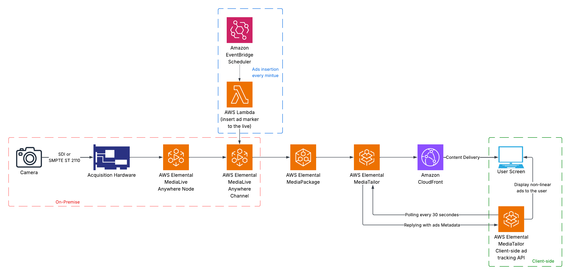

# Technical Guide: Non-Linear Ad Insertion - TrackFlix Live TV

## 1. Introduction and context

### What is a non-linear ad?

In online video, there are two main families of advertisements:

- **Linear**: they **replace** the video content (pre-roll, mid-roll, post-roll). The viewer must watch the ad before seeing their content.
- **Non-linear**: they are displayed **on top of** the video content without interrupting it. The viewer continues watching their video while the ad is visible.

```
  LINEAR AD                             NON-LINEAR AD
  ┌──────────────────────┐              ┌──────────────────────┐
  │                      │              │                      │
  │    ██████████████    │              │   Video playing...   │
  │    █  AD VIDEO  █    │              │                      │
  │    ██████████████    │              │                      │
  │                      │              │  ┌────────────────┐  │
  │  "Your video in      │              │  │  Overlay ad    │  │
  │   15 seconds..."     │              │  └────────────────┘  │
  └──────────────────────┘              └──────────────────────┘
  Video is REPLACED                     Video KEEPS playing
```

### Why this technical choice?

Non-linear ads offer several advantages for a live TV service:

1. **No interruption**: the viewer experience is not disrupted, which is crucial for live content
2. **Soft monetization**: overlays are less intrusive than a pre-roll
3. **Flexibility**: different formats can be displayed (banners, L-shaped) without touching the video stream

### Which types of non-linear ads do we support?

Our system supports two formats:

**Simple overlay**: a static image (banner) positioned at the bottom of the video player. Typical format: 480x70 pixels. Display duration is configurable (8-15 seconds by default). The TrackIt banner appears on top of the video without interrupting it:


**L-Shaped**: two images forming an "L" around the video. One horizontal image (top or bottom) and one vertical image (left or right). The video is dynamically resized to make room for the ads. Supports 4 positions: `top-right`, `top-left`, `bottom-right`, `bottom-left`. Here, the video is "pushed" to the top-right to make room for the TrackIt banners:


---

## 2. Overall video streaming architecture

### Overview

The system relies on a chain of AWS services that transform a raw video stream into a broadcastable stream with integrated ads:



The key point: **MediaTailor does not visually insert the ad into the video**. It inserts **metadata** (markers) into the HLS manifest. It is then the **client** (our React code) that reads this metadata and displays the ad components on top of the video.

---

## 3. AWS Pipeline: from source to browser

The video stream passes through 4 AWS services before reaching the viewer. Each has a distinct role:

| Service | In one sentence |
|---------|----------------|
| **AWS MediaLive** | Receives the raw stream (camera or MP4 file) and transcodes it into **9 simultaneous qualities** (from 234p to 1080p) for adaptive bitrate |
| **AWS MediaPackage** | Takes the MediaLive output and "packages" it into **HLS** (.m3u8) and **DASH** (.mpd) formats readable by browsers |
| **Amazon CloudFront** | Distributes the stream via a **global CDN** so each viewer is served by the nearest server |
| **AWS MediaTailor** | Intercepts as a proxy and **enriches the HLS manifest** with ad metadata (VAST) |

### Transmission creation order

When a new transmission is launched, services are created in this order (each step depends on the previous one):

1. **MediaPackage** first (packaging) — because MediaLive needs to know where to send its output
2. **MediaLive** next (transcoding) — connected to MediaPackage
3. **CloudFront** — an origin is dynamically added pointing to MediaPackage endpoints
4. **Start** the MediaLive channel — the stream begins broadcasting

The final broadcast URL looks like:
```
https://d2cg1811dvxahw.cloudfront.net/v1/master/.../index.m3u8
```

> **Source files**:
> - `apps/api/src/infrastructure/MediaLiveChannelsManager.ts`
> - `apps/api/src/infrastructure/MediaPackageChannelsManager.ts`
> - `apps/api/src/infrastructure/CloudFrontDistributionsManager.ts`

---

## 4. Automatic ad marker insertion: Lambda + EventBridge

### 4.1. The trigger: how are ads launched?

For MediaTailor to insert ads into the stream, the video stream must contain **SCTE-35 markers**. These markers signal to MediaTailor: "an ad break starts here, for a duration of X seconds".

In our system, these markers are injected **automatically** via a Lambda function triggered by EventBridge at regular intervals:

```
  EventBridge (every N minutes)
       │
       │  Automatic trigger
       v
  Lambda Function (Python)
       │
       │  API call: medialive.batch_update_schedule()
       v
  MediaLive Schedule
       │
       │  Insertion of a SCTE-35 marker
       │  of type "Time Signal"
       v
  Video stream (HLS)
       │
       │  The marker is present in the manifest
       v
  MediaTailor detects the marker
       │
       │  VAST request to the Ad Decision Server
       v
  Non-linear ads injected
  into the manifest metadata
```

### 4.2. SCTE-35: Time Signal vs Splice Insert

**SCTE-35** is a television industry standard for signaling events in a video stream (ads, breaks, return from commercial). There are two main types of markers:

| Type | Usage | Our case |
|------|-------|----------|
| **Splice Insert** | Signals a **linear** ad break (the video stream is replaced by the ad) | Not used for overlays |
| **Time Signal** | Signals an event with detailed **segmentation descriptors**, enabling more fine-grained use cases like non-linear ads | **This is the one we use** |

For non-linear ads (overlays), we use **Time Signal** because it allows sending rich segmentation descriptors that MediaTailor interprets to trigger non-linear ads instead of replacing the stream.

### 4.3. The Time Signal marker for non-linear ads

Here is the marker structure as configured in the MediaLive schedule:

```json
{
  "ActionName": "A11",
  "ScheduleActionSettings": {
    "Scte35TimeSignalSettings": {
      "Scte35Descriptors": [
        {
          "Scte35DescriptorSettings": {
            "SegmentationDescriptorScte35DescriptorSettings": {
              "SegmentationCancelIndicator": "SEGMENTATION_EVENT_NOT_CANCELED",
              "SegmentationDuration": 1800000,
              "SegmentationEventId": 11,
              "SegmentationTypeId": 56,
              "SegmentationUpid": "4558414d504c452f3031323334353637",
              "SegmentationUpidType": 9
            }
          }
        }
      ]
    }
  },
  "ScheduleActionStartSettings": {
    "ImmediateModeScheduleActionStartSettings": {
      "Time": "2025-08-25T08:39:13"
    }
  }
}
```

Each parameter in the segmentation descriptor has a specific role:

| Parameter | Value (example) | Description |
|-----------|-----------------|-------------|
| **`SegmentationEventId`** | `11` | Unique identifier for the ad break. Corresponds to SCTE-35 `segmentation_event_id`. Each insertion must have a distinct ID. |
| **`SegmentationCancelIndicator`** | `SEGMENTATION_EVENT_NOT_CANCELED` | Indicates whether the event is active or canceled. `NOT_CANCELED` = the ad break is active. A second marker with `CANCELED` can be sent to interrupt an ongoing break. |
| **`SegmentationDuration`** | `1800000` | Break duration in 90 kHz ticks (MPEG-TS standard). Here: `1,800,000 / 90,000 = 20 seconds`. If not specified, the break remains open until a cancellation marker is received. |
| **`SegmentationTypeId`** | `56` | Segmentation type according to the SCTE-35 specification (in decimal). Determines how MediaTailor interprets the marker. |
| **`SegmentationUpidType`** | `9` | Type of Unique Program Identifier (UPID). Value `9` corresponds to the ADI (Advertising Digital Identification) format. |
| **`SegmentationUpid`** | `"4558414d504c452f..."` | Unique identifier encoded in hexadecimal. Allows MediaTailor and the Ad Decision Server to associate the break with a specific campaign or advertiser. |

**Key points**:
- The **`ActionName`** (`"A11"`) must be unique per action in the MediaLive schedule (MediaLive rejects duplicates)
- **`ImmediateModeScheduleActionStartSettings`** triggers the marker immediately in the stream (as opposed to `FixedMode` which schedules at a precise time)
- **Duration in ticks** is calculated as: `seconds × 90,000`. For example, 20 seconds = `20 × 90,000 = 1,800,000 ticks`

### 4.4. Example Lambda to send this marker

Here is an example Lambda function in Python that sends this Time Signal marker to a MediaLive channel via `batch_update_schedule()`:

```python
import datetime
import boto3
import json


def lambda_handler(event, context):
    channel = "3805157"   # Target MediaLive channel ID

    medialive = boto3.client("medialive")

    action = build_time_signal(
        event_id=11,
        duration=1800000,                                      # 20 seconds (in 90kHz ticks)
        segmentation_type_id=56,
        segmentation_upid="4558414d504c452f3031323334353637",
        segmentation_upid_type=9,                              # ADI
    )

    try:
        response = medialive.batch_update_schedule(
            ChannelId=channel,
            Creates={"ScheduleActions": [action]},
        )
        print("MediaLive schedule response:")
        print(json.dumps(response, default=str))
    except Exception as e:
        print("Error creating Schedule Action")
        print(e)
        raise

    return response


def build_time_signal(event_id, duration, segmentation_type_id,
                      segmentation_upid, segmentation_upid_type):
    # Unique ActionName to avoid duplicates in the schedule
    now_str = datetime.datetime.utcnow().strftime("%Y-%m-%dT%H:%M:%SZ")
    action_name = f"non_linear_ad.{now_str}"

    return {
        "ActionName": action_name,
        "ScheduleActionSettings": {
            "Scte35TimeSignalSettings": {
                "Scte35Descriptors": [
                    {
                        "Scte35DescriptorSettings": {
                            "SegmentationDescriptorScte35DescriptorSettings": {
                                "SegmentationCancelIndicator": "SEGMENTATION_EVENT_NOT_CANCELED",
                                "SegmentationDuration": duration,
                                "SegmentationEventId": event_id,
                                "SegmentationTypeId": segmentation_type_id,
                                "SegmentationUpid": segmentation_upid,
                                "SegmentationUpidType": segmentation_upid_type,
                            }
                        }
                    }
                ]
            }
        },
        "ScheduleActionStartSettings": {
            "ImmediateModeScheduleActionStartSettings": {}
        },
    }
```

The Lambda is triggered by EventBridge and essentially does two things:
1. **`build_time_signal()`** builds the schedule action with the segmentation parameters (same as in the JSON above)
2. **`batch_update_schedule()`** sends this action to MediaLive, which immediately inserts the SCTE-35 marker into the stream

### 4.5. EventBridge: the automatic orchestrator

Amazon EventBridge triggers a Lambda at regular intervals via a **schedule rule**. This Lambda calls the `medialive.batch_update_schedule()` API to insert a Time Signal marker into the MediaLive channel schedule.

```
  EventBridge Rule
  ┌────────────────────────────────┐
  │ Name: ad-insertion-schedule    │
  │ Schedule: rate(5 minutes)      │
  │ Target: Lambda ad-inserter     │
  └────────────────────────────────┘
           │
           │ Every 5 min
           v
  ┌────────────────────────────────┐
  │ Lambda: ad-inserter (Python)   │
  │                                │
  │ 1. Builds the Time Signal      │
  │    marker (SCTE-35)            │
  │ 2. Calls MediaLive             │
  │    batch_update_schedule()     │
  │ 3. Marker is inserted          │
  │    immediately into the stream │
  └────────────────────────────────┘
           │
           v
  MediaLive inserts the SCTE-35
  Time Signal marker into the HLS stream
           │
           v
  MediaTailor detects the marker,
  queries the ADS (VAST), and enriches
  the manifest with ad metadata
```

This mechanism is entirely **serverless**: no server to manage, EventBridge and Lambda handle everything automatically.

---

## 5. AWS MediaTailor: integration and session

In our case, we use MediaTailor specifically for **non-linear** ads: it does not replace video segments, but it **enriches the HLS manifest with metadata** that the client then reads to display overlays.

### 5.1. The MediaTailor session

Each viewer creates a **unique session** by making a POST request to a URL built from the MediaTailor configuration. This session provides two essential URLs: the enriched manifest (to be read by the player) and the tracking URL (to be polled for ad metadata).

**The session URL** is constructed as follows:

```
https://{endpoint}/v1/session/{accountId}/{configName}/index.m3u8
         │                      │            │
         │                      │            └── MediaTailor configuration
         │                      │                name (contains the
         │                      │                insertion rules)
         │                      │
         │                      └── AWS account ID
         │
         └── MediaTailor endpoint (region-specific)
```

When a **POST** is made to this URL, MediaTailor responds with:
- `manifestUrl`: the URL of the enriched HLS manifest (the one the video player must read)
- `trackingUrl`: the URL to poll regularly to retrieve ad metadata to display

This `trackingUrl` is at the heart of the client-side mechanism.

### 5.2. The tracking URL: heart of the non-linear system

The `trackingUrl` is the endpoint that the client polls periodically (every 30 seconds in our case) to know if ads should be displayed. The response contains an array of `avails` (ad breaks) in JSON format:

```json
{
  "avails": [
    {
      "availId": "abc-123",
      "nonLinearAdsList": [
        {
          "nonLinearAdList": [
            {
              "adId": "trackit-overlay-001",
              "adTitle": "Trackit Social Listening",
              "creativeId": "overlay-banner",
              "staticResource": "https://...480x70.jpg",
              "clickThrough": "https://trackit.io",
              "width": "480",
              "height": "70",
              "durationInSeconds": 12
            }
          ]
        }
      ]
    }
  ]
}
```

The `nonLinearAdsList` field specifically contains non-linear ads (overlays). Each `availId` identifies a unique ad break, which prevents displaying the same ad multiple times.

---

## 6. The VAST standard: how to describe an ad

### 6.1. What is VAST?

VAST (**Video Ad Serving Template**) is an IAB (Interactive Advertising Bureau) standard that defines how to describe a video ad in XML. It is the universal "language" between ad servers and video players.

MediaTailor uses VAST to communicate with the **Ad Decision Server** (ADS). When MediaTailor needs to insert an ad, it makes an HTTP request to the ADS which responds with a VAST document describing the ad to display.

### 6.2. Structure of a VAST file for a non-linear ad

Here is the minimal structure for a simple overlay ad:

```xml
<VAST version="3.0">
  <Ad>
    <InLine>
      <AdSystem>2.0</AdSystem>                      <!-- Ad system -->
      <AdTitle>non-linear-ad-1</AdTitle>             <!-- Title for debugging -->
      <Creatives>
        <Creative>
          <NonLinearAds>                             <!-- = non-linear ad -->
            <NonLinear width="480" height="70"       <!-- Dimensions in pixels -->
                       minSuggestedDuration="00:00:10"> <!-- Display duration -->
              <StaticResource creativeType="image/png">
                <!-- URL of the image to display -->
                https://bucket-s3.amazonaws.com/480x70.png
              </StaticResource>
              <NonLinearClickThrough>
                <!-- URL opened when the viewer clicks -->
                https://trackit.io
              </NonLinearClickThrough>
            </NonLinear>
          </NonLinearAds>
        </Creative>
      </Creatives>
    </InLine>
  </Ad>
</VAST>
```

Key elements to remember:

| VAST Element | What it contains | Maps to in our code |
|---|---|---|
| `<NonLinear>` | Defines dimensions and duration | `width`, `height`, `duration` in `OverlayAdMetadata` |
| `<StaticResource>` | Ad image URL | `staticResource` |
| `<NonLinearClickThrough>` | Click destination URL | `clickThrough` |
| `<Creative id="...">` | Creative identifier | `creativeId` (used to detect type: "overlay" or "l-shape") |

### 6.3. VAST for an L-Shaped ad

For an L-Shaped, the VAST contains **two** `<NonLinear>` elements in the same `<NonLinearAds>`:
one for the horizontal image (top) and one for the vertical image (side).

```xml
<Creative id="l-shape-trackit">    <!-- The creativeId contains "l-shape" -->
  <NonLinearAds>
    <!-- Horizontal image (top) -->
    <NonLinear id="trackit-l-shape-top" width="400" height="90">
      <StaticResource creativeType="image/png">
        https://bucket-s3.amazonaws.com/lshape-top-400x90.png
      </StaticResource>
      <NonLinearClickThrough>https://trackit.io</NonLinearClickThrough>
    </NonLinear>

    <!-- Vertical image (side) -->
    <NonLinear id="trackit-l-shape-side" width="90" height="300">
      <StaticResource creativeType="image/png">
        https://bucket-s3.amazonaws.com/lshape-side-90x300.png
      </StaticResource>
      <NonLinearClickThrough>https://trackit.io</NonLinearClickThrough>
    </NonLinear>
  </NonLinearAds>
</Creative>
```

Our code detects an L-Shaped when:
1. The `creativeId` contains `"l-shape"` **AND**
2. There are multiple non-linear elements in the same `availId`
3. We identify "top" and "side" via the `creativeId` (contains "top" or "side")

### 6.4. Where are the ad images hosted?

Assets (images, videos) are stored in an S3 bucket:
- **Bucket**: `trackit-tv-mathis` (region `us-west-2`)
- **Assets**: `480x70.jpg` (overlay), `1000x150.png` (L-shape top), `250x450.png` (L-shape side), etc.

---

## 7. The video player: VideoPlayerAds

### 7.1. Why a wrapper on the video player?

The `VideoPlayerAds` component is a wrapper around a standard HLS.js player. This wrapper exists for three reasons:

1. **Integrate MediaTailor**: the native player cannot communicate with MediaTailor. Our component manages session initialization, metadata polling, and display decisions.

2. **Manage overlay display**: when MediaTailor signals an ad, the player must know which React component to render (OverlayAd or LShapedAd), position it correctly, and hide it after the planned duration.

3. **Track interactions**: every viewer action (play, pause, click on an ad, ad completion) must be reported to MediaTailor for reporting.

```
  Standard HLS.js player           Our VideoPlayerAds
  ┌──────────────────────┐         ┌──────────────────────────────┐
  │                      │         │                              │
  │  - Plays .m3u8 stream│         │  - Plays .m3u8 stream        │
  │  - Manages buffering │         │  - Manages buffering         │
  │  - Adaptive bitrate  │         │  - Adaptive bitrate          │
  │                      │         │  + MediaTailor session       │
  │                      │         │  + Metadata polling          │
  │                      │         │  + OverlayAd display         │
  │                      │         │  + LShapedAd display         │
  │                      │         │  + Event tracking            │
  │                      │         │  + Video quality selection   │
  │                      │         │  + Ad deduplication mgmt     │
  └──────────────────────┘         └──────────────────────────────┘
```

### 7.2. The 3 component props

The component is intentionally minimalist in terms of API:

```typescript
<VideoPlayerAds
  src={videoUrl}                           // HLS stream URL
  enableMediaTailorTracking={true}         // Enables the ad system
  mediaTailorSessionInitUrl={sessionUrl}   // URL to initialize the session
/>
```

- **`src`**: the HLS video stream URL (from CloudFront). If MediaTailor is active, this URL will be automatically replaced by the MediaTailor session's `manifestUrl`.
- **`enableMediaTailorTracking`**: boolean on/off. If `false`, the player works as a normal video player with no ads.
- **`mediaTailorSessionInitUrl`**: the URL built from the MediaTailor configuration (endpoint + accountId + configName). This is the URL where the initialization POST will be sent.

### 7.3. Component lifecycle

Here is what happens when the component is mounted:

```
  Component mount
         │
         v
  1. HLS.js initialization
     - Loads the video stream
     - Detects available qualities
     - Starts playback
         │
         v
  2. MediaTailor initialization (if active)
     - POST to sessionInitUrl
     - Receives manifestUrl + trackingUrl
     - Replaces video source with manifestUrl
         │
         v
  3. Start polling (every 30s)
     ┌─────────────────────────────┐
     │ GET trackingUrl             │<─────────────┐
     │      │                      │              │
     │      v                      │              │
     │ Non-linear ads present?     │              │
     │      │                      │              │
     │    ┌─┴─┐                    │        30 seconds
     │   YES  NO ── (wait) ───────>│──────────────┘
     │    │                        │
     │    v                        │
     │ Already displayed (availId)?│
     │    │                        │
     │  ┌─┴─┐                      │
     │ YES  NO                     │
     │  │    │                     │
     │  │    v                     │
     │  │  creativeId contains     │
     │  │  "l-shape"?              │
     │  │    │                     │
     │  │  ┌─┴────────────┐        │
     │  │ YES            NO        │
     │  │  │              │        │
     │  │  v              v        │
     │  │ LShaped     OverlayAd    │
     │  │  │              │        │
     │  │  v              v        │
     │  │ Auto-hide after N sec    │
     │  │                          │
     │  └── (ignore) ─────────────>│──────────────┘
     └─────────────────────────────┘
```

### 7.4. Video source management

A subtle but important point: when MediaTailor is active, we don't play the original video stream but the **MediaTailor manifest**:

```typescript
// The video source is automatically replaced
const videoSrc = mediaTailorSession?.manifestUrl || src;
```

This means that if the MediaTailor session is active, the player reads the enriched manifest (which contains ad metadata). Otherwise, it uses the original stream.

### 7.5. HLS.js configuration

HLS.js is the library that enables HLS stream playback in browsers (except Safari which supports it natively). Our configuration is optimized for live:

```typescript
const hls = new Hls({
  lowLatencyMode: true,        // Reduces latency for live
  liveSyncDurationCount: 5,    // Number of segments for synchronization
  liveMaxLatencyDurationCount: 10, // Max acceptable latency
  maxBufferLength: 30,         // Max buffer in seconds
  liveDurationInfinity: true,  // No stream end (it's live)
});
```

> **Source file**: `libs/webui/ui/src/video-player/video-player-ads.tsx`

---

## 8. The client-side MediaTailor service

### 8.1. Service architecture

The client-side MediaTailor service is structured in three layers:

```
  ┌─────────────────────────────────────────┐
  │          React Component                │
  │      (VideoPlayerAds)                   │
  │                                         │
  │  Uses the hook to access                │
  │  data and actions                       │
  └──────────────┬──────────────────────────┘
                 │ uses
                 v
  ┌─────────────────────────────────────────┐
  │       React Hook                        │
  │   (useMediaTailorService)               │
  │                                         │
  │  Synchronizes service state             │
  │  with React state                       │
  │  Provides memoized methods              │
  └──────────────┬──────────────────────────┘
                 │ wraps
                 v
  ┌─────────────────────────────────────────┐
  │       Singleton Service                 │
  │   (MediaTailorService)                  │
  │                                         │
  │  Manages session, polling,              │
  │  ad extraction, tracking                │
  │  Singleton = single instance            │
  └─────────────────────────────────────────┘
```

**Why a singleton?** Because we want a single MediaTailor session per page, even if the component re-renders. The singleton guarantees that we don't create multiple sessions or duplicate polling.

**Why a hook on top?** Because the singleton is not "reactive". The hook uses the service's event system to synchronize React state (`useState`) with the service's internal state.

### 8.2. Session initialization

Initialization creates a unique session for this viewer:

```
  Client                          MediaTailor API
    │                                   │
    │  POST /v1/session/{account}/{config}/index.m3u8
    │  Body: { adsParams, sessionParameters }
    │ ─────────────────────────────────>│
    │                                   │
    │  Response: {                      │
    │    manifestUrl: "/v1/manifest/...",│
    │    trackingUrl: "/v1/tracking/..." │
    │  }                                │
    │ <─────────────────────────────────│
    │                                   │
    │  Returned URLs are relative,      │
    │  the service completes them       │
    │  with the baseUrl                 │
    │                                   │
```

The service then processes the returned URLs: since MediaTailor may return relative URLs (starting with `/`), the service automatically completes them with the endpoint domain.

### 8.3. Polling and ad extraction

Polling is the central mechanism. Every 30 seconds, the service queries the `trackingUrl` and extracts non-linear ads:

```
  GET trackingUrl
       │
       v
  JSON response with "avails"
       │
       v
  For each avail:
       │
       ├── Does the avail have a "nonLinearAdsList"?
       │       │
       │      NO ── (ignore, it's a linear ad)
       │       │
       │      YES
       │       │
       │       v
       │   Is the availId already in displayedAvailIds?
       │       │
       │      YES ── (ignore, already displayed)
       │       │
       │      NO
       │       │
       │       v
       │   Extract metadata:
       │   adId, creativeId, staticResource,
       │   clickThrough, dimensions, duration
       │       │
       │       v
       │   Add to overlayAds array
       │
       v
  If overlayAds.length > 0:
  Emit onOverlayAdsFound event
```

### 8.4. Deduplication by availId

Each ad break has a unique `availId`. The service maintains a `Set<string>` of all already-displayed `availId`s. This prevents displaying the same ad on every polling cycle (since the same ad can remain in the tracking response for several minutes).

> **Source files**:
> - Service: `libs/webui/ui/src/video-player/services/MediaTailorService.ts`
> - Hook: `libs/webui/ui/src/video-player/hooks/useMediaTailorService.ts`
> - Types: `libs/webui/ui/src/video-player/types.ts`

---

## 9. Ad display components

### 9.1. OverlayAd: the simple banner

The `OverlayAd` component displays a static image positioned on top of the video player. It is the simplest and most common format.


The banner is positioned at `bottom-center` with `z-index: 1000` to be above all other player elements.

**How it works**:
1. The component receives ad data (`adData`) and a visibility flag (`isVisible`)
2. When `isVisible` becomes `true`, a timer is started (duration = `adData.duration` or 10 seconds by default)
3. At the end of the timer, the `onAdComplete` and `onAdClose` callbacks are called
4. If the viewer clicks on the image, `onAdClick` is called with the destination URL

> **Source file**: `libs/webui/ui/src/video-player/components/OverlayAd.tsx`

### 9.2. LShapedAd: the L-shaped ad

The `LShapedAd` component is more complex: it displays two images forming an "L" and **dynamically resizes the video area** to make room for the ads.


In this screenshot, we can clearly see the `bottom-left` layout: the vertical banner occupies the left side, the horizontal banner occupies the bottom, and the video is "pushed" to the top-right. The 4 possible layouts are:

| Layout | Horizontal image | Vertical image | Video pushed to |
|--------|-----------------|----------------|-----------------|
| `top-right` | Top | Right | Bottom-left |
| `top-left` | Top | Left | Bottom-right |
| `bottom-right` | Bottom | Right | Top-left |
| `bottom-left` | Bottom | Left | Top-right |

**Animation**: the ad images appear with a "staggered" animation:
1. The horizontal image appears first (0.5s delay)
2. The vertical image appears next (0.7s delay)
3. The video resizes smoothly with a `cubic-bezier(0.23, 1, 0.32, 1)` transition of 1.4 seconds

**How is the video resized?** In `VideoPlayerAds`, the video area is a `div` with CSS properties `top`, `left`, `right`, `bottom` as percentages. When an L-shaped is active, these values change from `0%` to `25%` on the relevant sides, which "pushes" the video smoothly.

> **Source file**: `libs/webui/ui/src/video-player/components/LShapedAd.tsx`

---

## 10. Tracking and analytics

### 10.1. Why track?

Tracking allows the advertiser to know:
- How many viewers **saw** the ad (impressions)
- How many **clicked** on it (clicks)
- How long the ad remained visible (completion)

Without tracking, no ad revenue, because advertisers pay per view/click.

### 10.2. Tracking format: GET beacons

Tracking events are sent as **beacons**: GET requests with information in query parameters. This format is chosen because:
- GET requests are simple and lightweight
- `keepalive: true` guarantees delivery even if the page closes
- No body to serialize

```
GET {trackingUrl}?sessionId=xxx&eventType=ad_complete&currentTime=45.2&duration=120
```

### 10.3. Tracked events

| Event | When it is sent |
|-------|----------------|
| `play` | The viewer starts or resumes the video |
| `pause` | The viewer pauses |
| `timeupdate` | Every 10 seconds of playback |
| `ad_start` | An ad starts displaying |
| `ad_complete` | An ad has finished displaying (timer elapsed or click) |
| `ad_click` | The viewer clicked on the ad |
| `ad_error` | Error while displaying an ad |

### 10.4. Resilience principle

Tracking must **never** break video playback. All tracking errors are silently caught:

```typescript
// Tracking errors are not propagated
try {
  await fetch(beaconUrl, { method: 'GET', keepalive: true });
} catch (error) {
  console.log('Tracking error:', error);
  // NO throw - video continues
}
```

---

## File tree

```
libs/webui/ui/src/video-player/
├── video-player-ads.tsx              # Video player with MediaTailor integration
├── video-player.tsx                  # Simple video player (no ads)
├── types.ts                          # Shared TypeScript types
├── utils.ts                          # Utilities (formatBitrate)
├── constants.ts                      # Constants
├── index.ts                          # Public exports
├── services/
│   └── MediaTailorService.ts         # MediaTailor singleton service
├── hooks/
│   └── useMediaTailorService.ts      # React hook for the service
└── components/
    ├── OverlayAd.tsx                 # Overlay banner component
    └── LShapedAd.tsx                 # L-shaped ad component

libs/webui/live-view/src/lib/
└── live-view.tsx                     # Live TV page (final integration)

apps/api/src/infrastructure/
├── MediaLiveChannelsManager.ts       # MediaLive channel management
├── MediaPackageChannelsManager.ts    # MediaPackage channel management
└── CloudFrontDistributionsManager.ts # CloudFront distribution management

Lambda (Python, deployed on AWS):
└── ad-inserter                       # Automatic SCTE-35 marker insertion
    └── lambda_handler                #   via EventBridge + batch_update_schedule()
```
