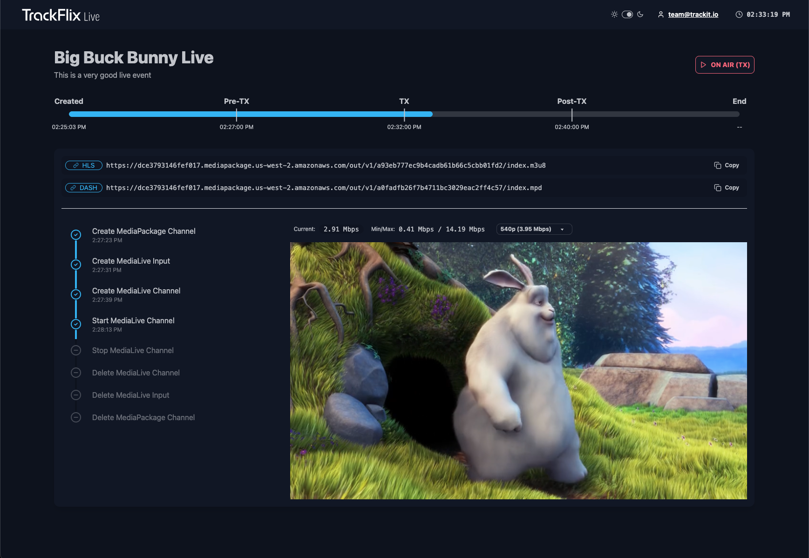

# Trackflix Live




This project utilizes AWS Elemental MediaLive and MediaPackage to transform MP4 files into live streams,
all running on AWS using serverless services.
MediaLive ingests the MP4 files, processes them in real time, and converts them into live stream formats.
MediaPackage ensures secure and reliable delivery of the live stream across multiple devices.
By leveraging AWS serverless architecture, the solution scales automatically,
minimizing operational overhead and providing a cost-efficient, high-quality live streaming experience for global audiences.

This project is a mono-repo using [Nx](https://nx.dev/) as its build system.

# Code quality and Unit tests

You can run Prettier, ESLint, type checks and unit tests using the following commands:

```shell
$ nx run-many -t lint # Runs ESLint on all Nx projects
$ nx run-many -t prettier # Runs Prettier on all Nx projects
$ nx run-many -t typecheck  # Runs Typescript type-checking on all Nx projects
$ nx run-many -t test  # Runs unit tests on all Nx projects
```

# Back-end

More information in the Back-end [README.md](apps/api/README.md)

# Front-end

More information in the Back-end [README.md](apps/webui/README.md)

# License

Copyright 2025 TrackIt

Licensed under the Apache License, Version 2.0 (the "License");
you may not use this file except in compliance with the License.
You may obtain a copy of the License at

  [LICENSE.md](./LICENSE.md)

Unless required by applicable law or agreed to in writing, software
distributed under the License is distributed on an "AS IS" BASIS,
WITHOUT WARRANTIES OR CONDITIONS OF ANY KIND, either express or implied.
See the License for the specific language governing permissions and
limitations under the License.
