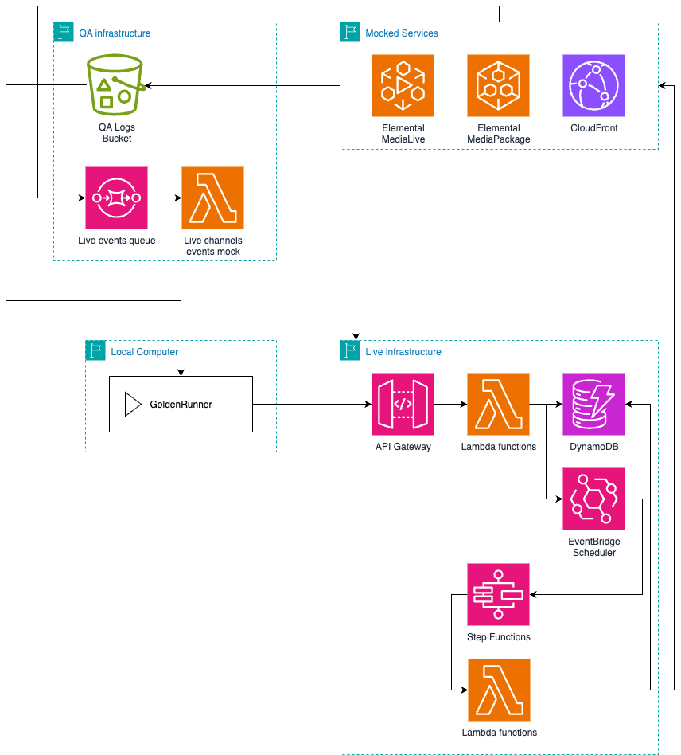

# Golden tests

Golden tests are comprehensive end-to-end integration tests designed to validate the complete functionality of the Trackflix Live system.
These tests ensure that all components work together correctly by simulating real-world user scenarios and verifying both the API responses and the underlying infrastructure behavior.
Unlike unit tests that focus on individual components, golden tests validate the entire system flow from user interactions through to live streaming resource management based on real-world scenarios.



As seen in the diagram, the test runner itself is running on a local computer (or CI/CD pipeline).
This local test runner will make requests to Trackflix Live's API endpoint to simulate user activity.

Most of Trackflix Live is running in its standard Live configuration apart from a few details that have been changed for test purposes:
- The condition that a live must be created at least 6 minutes before its air time is removed.
- The start transmission state machine will run 2 minutes before air time instead of 5 minutes before air time.
- All the live resources created/destroyed when starting and ending live transmissions are mocked: instead of creating them, we log the actions in an S3 bucket for QA logs: 
this bucket of logs is used to assert live resources creation and destruction in the test runner.
- Since MediaLive is not called because of the mocked resources, there is an SQS queue with a slight delay and a Lambda function that sends mocked MediaLive events to Trackflix Live to simulate the channels being created/started/stopped/destroyed.

## 1. Deploying an environment for golden tests

To deploy an environment for running the golden tests, set the `QA_MODE` environment variable to `true` in your `.env` file.

Then execute the standard deployment command:
```shell
$ nx run api:deploy
```

After deployment, generate the environment file for the golden tests using the following command:
```shell
$ nx run api-goldens:generateEnvironment
```

## 2. Running golden tests

Execute the golden tests with the following command:
```shell
$ nx run api-goldens:run
```

## 3. Adding golden tests

Add a new folder in `src/scenarios` following the name convention: `GOLDEN-XXX`.
In this folder, create a `scenario.test.ts` file and use the following template as a base for your new golden test:
```typescript
import { GoldenRunner } from '../../framework/GoldenRunner';
import { Scenario, ScenarioStepType } from '../../framework/Scenario';

const scenario: Scenario = {
  users: [],
  steps: [],
};

describe('GOLDEN-XXX', () => {
  const runner = new GoldenRunner(scenario);
  runner.run();
});
```

### 3a. Adding users

When sending requests to the API, you must do so on the behalf of a user.
Add an object in the `users` array describing your scenario. It is recommended to use a variable for later references to the user.
```typescript
const myUser = 'my-user@example.com';

const scenario: Scenario = {
  users: [
    {
      username: myUser,
    }
  ],
  steps: [],
};
```

By default, users are viewers only. Add `isCreator: true` to the user's object to make him a creator.
```typescript
const myCreator = 'my-creator@example.com';

const scenario: Scenario = {
  users: [
    {
      username: myCreator,
      isCreator: true,
    }
  ],
  steps: [],
};
```

### 3b. Adding steps

Steps are the building blocks of scenarios. Start by laying out your test scenario using `TODO` steps:
```typescript
const scenario: Scenario = {
  users: [],
  steps: [
    {
      name: 'Creator creates an event',
      type: ScenarioStepType.TODO,
    },
    {
      name: 'Creator deletes an event',
      type: ScenarioStepType.TODO,
    }
  ],
};
```
`TODO` steps will do nothing and are only used as placeholders. There are three other types of steps that can be used:
- `REQUEST`: This step type will make a request to the API.
- `WAIT_FOR_REQUEST`: This step type will make requests to the API until a certain condition is met with a maximum number of retries and pauses between requests.
- `VERIFY_RESOURCES`: This step type will assert the presence of specific live resources events.

#### The `REQUEST` step can be configured with the following options:

| Property           | Required? | Description                                                                                                                            |
|--------------------|-----------|----------------------------------------------------------------------------------------------------------------------------------------|
| user               | Yes       | The user who will send the request, use the variables created during users setup.                                                      |
| route              | Yes       | The route to target, can be a string such as `/event` or a function which takes the cache in parameter and returns a string.           |
| method             | No        | The HTTP method used, defaults to a GET request.                                                                                       |
| body               | No        | The body of the request, will be stringified.                                                                                          |
| expectedStatusCode | No        | The HTTP status code that is expected, tests will fail if it is not correct. Defaults to 200.                                          |
| expectedResponse   | No        | An object or array that will be passed to jest's toMatchObject matcher . If this value is not provided, the body will not be asserted. |

#### The `WAIT_FOR_REQUEST` step can be configured with the following options:

| Property              | Required? | Description                                                                                                                           |
|-----------------------|-----------|---------------------------------------------------------------------------------------------------------------------------------------|
| user                  | Yes       | The user who will send the request, use the variables created during users setup.                                                     |
| route                 | Yes       | The route to target, can be a string such as `/event` or a function which takes the cache in parameter and returns a string.          |
| method                | No        | The HTTP method used, defaults to a GET request.                                                                                      |
| body                  | No        | The body of the request, will be stringified.                                                                                         |
| expectedStatusCode    | No        | The HTTP status code that is expected, tests will fail if it is not correct. Defaults to 200.                                         |
| expectedResponse      | No        | An object or array that will be passed to jest's toMatchObject matcher  If this value is not provided, the body will not be asserted. |
| secondsBetweenRetries | Yes       | The number of seconds to wait between retries.                                                                                        |
| maximumRetries        | Yes       | The maximum number of retries before failing the test.                                                                                |

#### The `VERIFY_RESOURCES` step can be configured with the following options:

| Property      | Required? | Description                                                                |
|---------------|-----------|----------------------------------------------------------------------------|
| eventId       | Yes       | A function which takes the cache in parameter and returns a string.        |
| before        | No        | A Date object, if specified, only logs before the date will be considered. |
| after         | No        | A Date object, if specified, only logs after the date will be considered.  |
| expectedCalls | Yes       | The expected calls to live resources services.                             |

## 4. CI/CD

A GitHub Actions workflow is available to run the golden tests. It uses OpenID Connect (OIDC) to securely allow GitHub to access AWS resources without requiring long-lived credentials.

First, create a `.env` file in `apps/api-goldens-ci` following this template:
```dotenv
STAGE=qa
GITHUB_ORG_USER=
GITHUB_REPO_NAME=
OIDC_AUDIENCE=sts.amazonaws.com
```

Next, deploy the stack containing the OIDC provider and IAM role used by GitHub:
```shell
$ nx run api-goldens-ci:deploy
```

The stack output will provide an IAM role ARN. Create a GitHub Actions secret with the name `AWS_ROLE_TO_ASSUME` and set its value to this role ARN.
Once this is done, the workflow can be started manually from GitHub.
