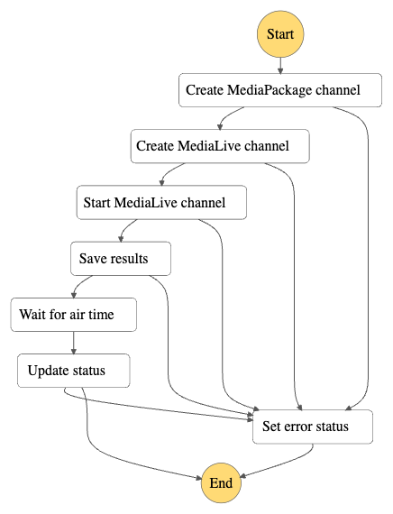
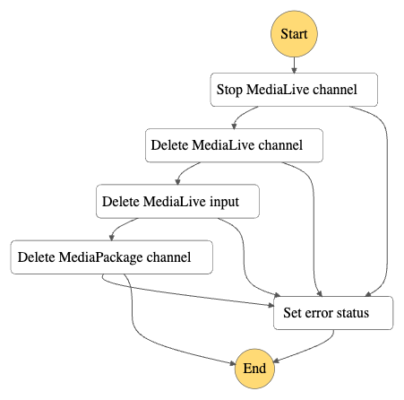

# Back-end

## Quick tour
This project uses [AWS SAM](https://aws.amazon.com/serverless/sam/) to deploy the infrastructure and [Lambda](https://aws.amazon.com/lambda/) functions.  
[API Gateway](https://aws.amazon.com/api-gateway/) provides the API for the back-end while
[DynamoDB](https://aws.amazon.com/dynamodb/) is used as the database for the project.  
[Cognito](https://aws.amazon.com/cognito/) is used for authentication and [Step Functions](https://aws.amazon.com/step-functions/) manages the workflows for starting and stopping live transmissions, triggered by [EventBridge Scheduler](https://docs.aws.amazon.com/scheduler/latest/UserGuide/what-is-scheduler.html).
[IoT Core](https://aws.amazon.com/iot-core/) is used to provide live feedback to the web application.

This Nx app contains all the code tied to infrastructure and implementation details while the core business logic code is located in the [api-events](../../libs/api/api-events/README.md) library.

## Deploy the solution
In order to deploy the solution, you must have valid AWS credentials. This will vary depending on your AWS environment configuration.

Node must be installed: [Install Node](https://nodejs.org/en/download)  
AWS SAM must be installed: [Install the AWS SAM CLI](https://docs.aws.amazon.com/serverless-application-model/latest/developerguide/install-sam-cli.html)

You must install the project's dependencies.
```shell
$ npm i
```

You must create a `.env` file in the root folder of the application.  
The content will be the following:
```dotenv
STAGE=<your_stage_name>
WAITING_SOURCE=s3://<bucket>/<filename>.mp4
```
The stage name can be anything you want while the waiting source has to point to an MP4 video file that will be displayed once the MediaLive stream is started, but before the air time has been reached.
This video should be at least 5 minutes long as this is the maximum time between the stream's start time and the air time. This video should be in the same AWS account as where the solution is deployed.

Once the environment file is ready, you can run the following command which will build and deploy the application:
```shell
$ nx run api:deploy
```

## Handlers

The handlers for most Lambda functions including the ones used for the API can be found in the `src/handlers` folder.

These handlers are calling adapters which are in charge of formatting the data for the use cases (which are the core business logic).
They validate the data that has been given through the HTTP API and transform errors thrown by the use cases to proper HTTP errors.

Currently, there are three handlers unrelated to the API:  
- The `handleMediaLiveChannelStateChange` handler: it receives events from MediaLive through EventBridge and resumes state machines accordingly using the task tokens DynamoDB table.
- The `startTransmission` handler: it is triggered by EventBridge Scheduler and start a new Start transmission state machine execution.
- The `stopTransmission` handler: it is triggered by EventBridge Scheduler and start a new Stop transmission state machine execution.

## State machines

The handlers for Lambda functions used in state machines can be found in the `src/stateMachines` folder.

### Start transmission

<p align="center">
  
</p>
This state machine handles the creation of the Amazon Elemental resources:

#### 1. Create MediaPackage channel
This task calls the `createPackageChannel` use case which creates the MediaPackage channel.
An HLS endpoint and a DASH endpoint are also created.

#### 2. Create MediaLive channel
This handler calls the `createLiveChannel` use case which creates the MediaLive channel as well as two inputs: 
one for the waiting screen and one for the actual content.  
It also creates a task token in the database: this will allow the `handleMediaLiveChannelStateChange` lambda function to resume the state machine once the channel is created.

#### 3. Start MediaLive channel
This handler calls the `startLiveChannel` use case which starts the MediaLive channel.
Beforehand, it also creates the schedule action that will switch from the waiting screen to the content at the `onAirStartTime` date and time.
Finally, it creates a task token to resume the state machine once the MediaLive channel is started.

#### 4. Save results
This handler calls the `saveResults` use case which updates some values in the database.

#### 5. Wait for air time
This is a Wait task which waits for the transmission's on air start time.

#### 6. Update status
This handler calls the `updateStatus` use case which updates some values in the database.

### Stop transmission

<p align="center">
  
</p>
This state machine handles the deletion of the Amazon Elemental resources:

#### 1. Stop MediaLive channel
This handler calls the `stopLiveChannel` use case which stops the MediaLive channel.
It also creates a task token to resume the state machine once the MediaLive channel is stopped.

#### 2. Delete MediaLive channel
This handler calls the `deleteLiveChannel` use case which deletes the MediaLive channel.
It also creates a task token to resume the state machine once the MediaLive channel is deleted.

#### 3. Delete MediaLive input
This handler calls the `deleteLiveInput` use case which deletes both MediaLive inputs.

#### 4. Delete MediaPackage channel
This handler calls the `deletePackageInput` use case which deletes the MediaPackage channel and both its endpoints.

## Infrastructure

In the `src/infrastructure` folder, you will find implementations for the core's ports: they tie the infrastructure to the core business logic.
